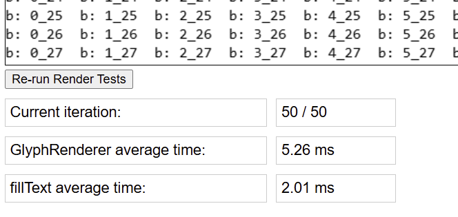

# canvas2dText
POC to test performance differences between rendering grid with native fillText API vs. custom glyph renderer.

The custom renderer is very simplistic and only renders some mono-space chars

The test renders on `canvas` element a grid of 30x28 cells with different text in each cell. The resulting average timing is tracked and displayed.

We can see from the test page that `fillText` is much more performant than the custom renderer.
It is unclear if there is a more optimize way to improve the custom renderer.

Try the POC here:

https://nhelfman.github.io/canvas2dText/

