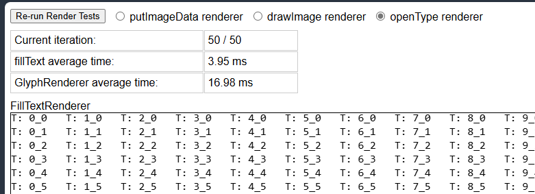

# canvas2dText
POC to test performance differences between rendering grid with native `fillText` API vs. other rendering options.

The custom renderers are very simplistic and only renders some mono-space chars

The test renders on on 2 `canvas` elements a grid of 30x28 cells with different text in each cell. The resulting average timing is tracked and displayed.

We can see from the test page that `fillText` is much more performant than any other render options.
It is unclear if there is a more optimize way to improve rendering of the grid on canvas.

The UI enables selecting different glyph rendering methods:
- using `putImageData` - precache glyphs as `ImageData` and draw them on the canvas using `putImageData` API
- using `drawImage` - precache glyphs as `BitmapImage` and draw them on the canvas using `drawImage` API
- using `opentype.js` library (hacked version) - precache glyphs drawing path and use opentype to draw on canvas
- using `parallel workers` - multiple Web Worker that use `fillText` to draw parts of the grid in parallel

Try the POC here:

https://nhelfman.github.io/canvas2dText/

